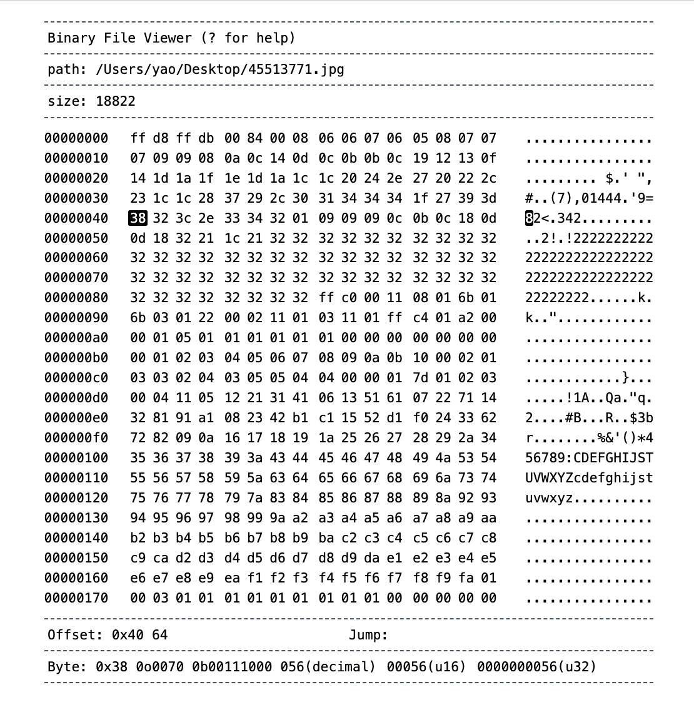

# binary-file-viewer

A binary file viewer.



## Usage

1. install

```
$ npm i -g binary-file-viewer
```

2. start

```
$ bfv <file-path>
```

## Development

1. install

```
$ npm i
```

2. set dev mode

change `.env` file

```
mode="development"
```

3. start dev server

```
$ node app.js <file-path>
```

4. start client

```
$ npm run dev
```
